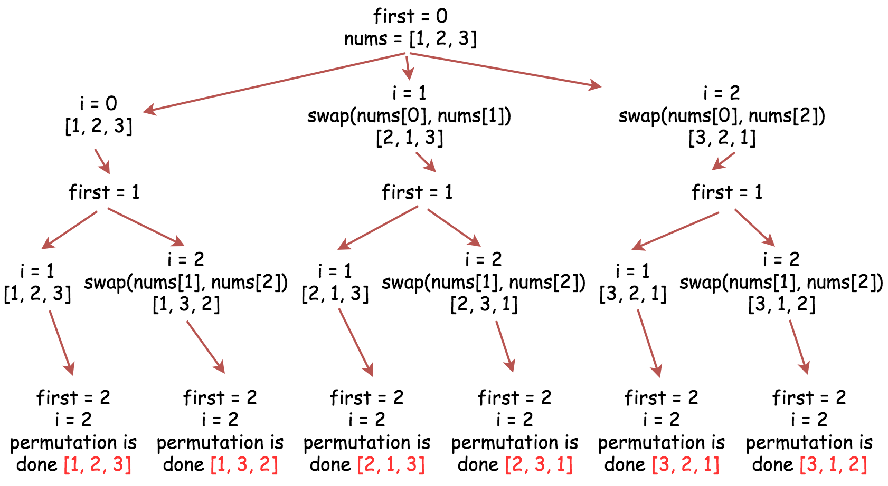
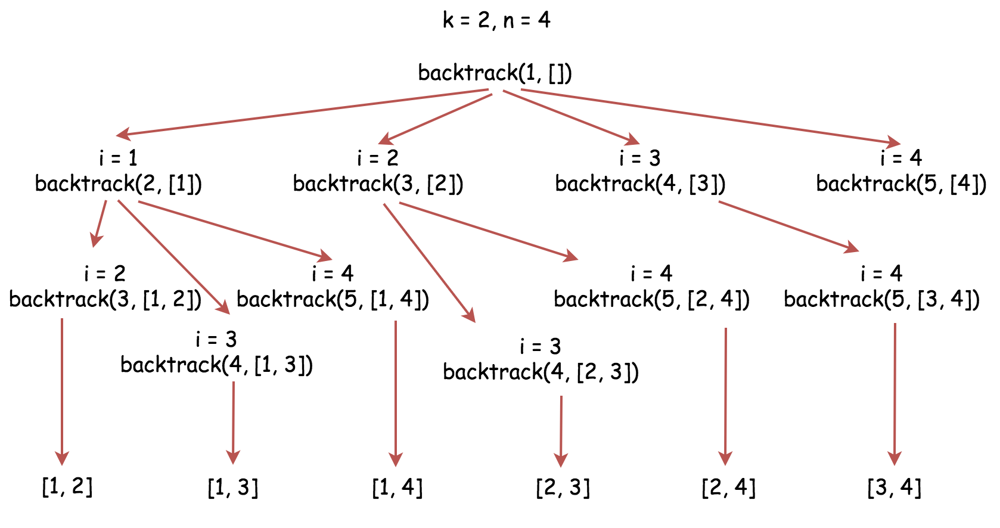

# 46. permutations
## Problem (Medium):
Given an array nums of distinct integers, return all the possible permutations. You can return the answer in any order.
```
Input: nums = [1,2,3]
Output: [[1,2,3],[1,3,2],[2,1,3],[2,3,1],[3,1,2],[3,2,1]]
```
## Solution:
### BTS with Backtracking:
Explaination check: 


Time Complexity: $\Omicron(\sum_{k=1}^{N}P(N,k))$, where $P(N,k) = \frac{N!}{(N-K)!} = N(N-1)...(N-K+1)$ is so-called k-permutations of n or partial permutation.

Space Complexity: O(n!)  n elements of full permutations has n! results.

```
class Solution {
    List<List<Integer>> res = new ArrayList<>();
    
    public List<List<Integer>> permute(int[] nums) {
        // convert array to list
        List<Integer> nums_list = new ArrayList<>();
        for (int i=0; i<nums.length; i++) {
            nums_list.add(nums[i]);
        }
        
        backtracking(0, nums_list);
        
        return res;
    }
    
    // helper for backtracking
    private void backtracking(int first, List<Integer> nums) {
        if (first==nums.size()-1) {
            res.add(new ArrayList<>(nums));
        }
        for (int i=first; i<nums.size(); i++) {
            Collections.swap(nums, first, i);
            backtracking(first+1, nums);
            Collections.swap(nums, i, first);
        }
    }
}
```

# 77. Combinations
## Problem (Medium):
Given two integers n and k, return all possible combinations of k numbers out of the range [1, n].

You may return the answer in any order.
```
Input: n = 4, k = 2
Output:
[
  [2,4],
  [3,4],
  [2,3],
  [1,2],
  [1,3],
  [1,4],
]
```
## Solution:
### Backtracking:
Notes: ArrayList object is called by reference. Remember copy it everytime whiling adding into result.

Time Complexity: $\Omicron(k\binom{n}{k})$

Space Complexity: $\Omicron(k\binom{n}{k})$

```
class Solution {
    int k;
    int[] nums;
    List<List<Integer>> res;
    
    public List<List<Integer>> combine(int n, int k) {
        if (n==0) return new ArrayList<>();
        // create number list
        nums = new int[n];
        for (int i=0; i<n; i++) {
            nums[i] = i+1;
        }
        // init
        this.k = k;
        this.res = new ArrayList<>();
        // call helper function
        backtracking(0, new ArrayList<Integer>());
        return res;
    }
    // 1, 2, 3, 4, 5
    public void backtracking(int first, List<Integer> curr) {
        if (curr.size() == k) {
            res.add(new ArrayList<>(curr));
        }
        
        for (int i=first; i<nums.length; i++) {
            curr.add(nums[i]);
            backtracking(i+1, curr);
            curr.remove(curr.size()-1);
        }
    }
}
```

# 79. Word Search
## Problem (Medium):
Given an m x n grid of characters board and a string word, return true if word exists in the grid.

The word can be constructed from letters of sequentially adjacent cells, where adjacent cells are horizontally or vertically neighboring. The same letter cell may not be used more than once.

```
Input: board = [["A","B","C","E"],["S","F","C","S"],["A","D","E","E"]], word = "ABCCED"
Output: true
```
## Solution:
### Backtracking:
Note: strongly suggest do it again. Not fully understand.

Time Complexity: $\Omicron(N*3^L)$
N is number of cells in the board. L is the length of word to be matched. There are 4 directions to explore. But we never go back, therefore, we actually explore 3 directions for each letter in word.

Space Complexity: $\Omicron(N)$ N is number of cells in the board. Because I used one visited matrix to mark the visiting status of each point.

But, in the solution offered by LeetCode, they always mark the current cell with '#', and give it back with word.charAt(index) after recursive calling backtrack function. We only mark it with #, when char matches, therefore, it is correct. Very smart. In this case, the space complexity is $\Omicron(L)$


```
class Solution {
    char[][] board;
    String word;
    boolean[][] visited;
    // helpers
    int[] dr = new int[] {0, 0, 1, -1};
    int[] dc = new int[] {1, -1, 0, 0};
    
    public boolean exist(char[][] board, String word) {
        //edge case
        if (board.length==0 || board[0].length==0 || word.length()==0) {
            return false;
        }
        // init
        this.board = board;
        this.word = word;
        this.visited = new boolean[board.length][board[0].length];
        
        // call backtrack help function
        for (int r=0; r<board.length; r++) {
            for (int c=0; c<board[0].length; c++) {
                if (backtrack(r, c, 0)) {
                    return true;
                }
            }
        }
        
        return false;
    }
    
    private boolean backtrack(int row, int col, int curr) {
        // step1: base case
        if (curr >= word.length()) {
            return true;
        }
        
        // step2: check boundaries
        if (row<0 || col<0 || row>=board.length || col>=board[0].length || word.charAt(curr)!=board[row][col] || visited[row][col]) {
            return false;
        }
        
        // step3: explore neighbours
        visited[row][col] = true;
            
        for (int i=0; i<4; i++) {
            if (backtrack(row+dr[i], col+dc[i], curr+1)) {
                return true;
            }
        }
         
        // step4: reset
        visited[row][col] = false;
        return false;
    }
}
```