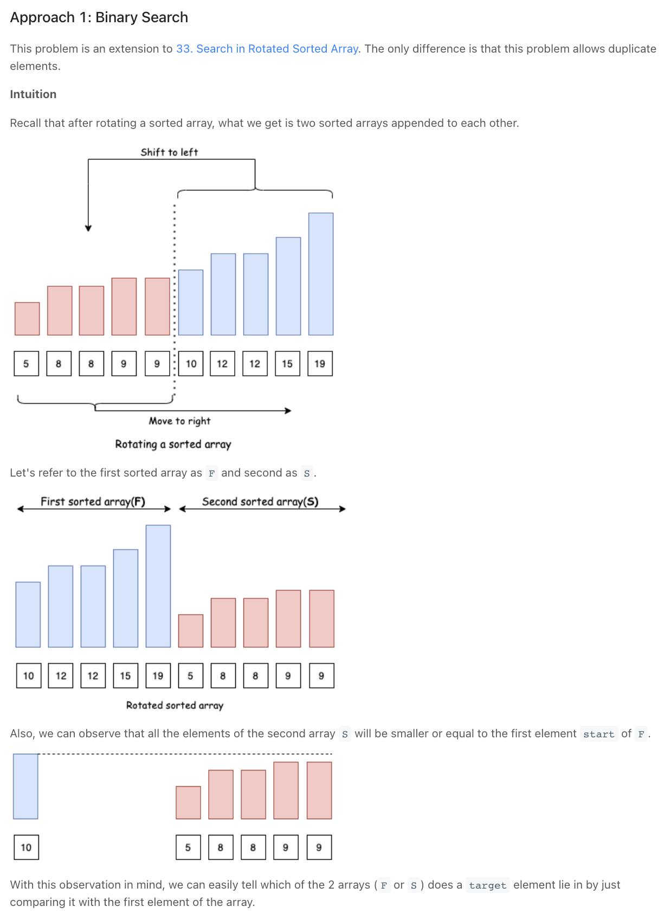
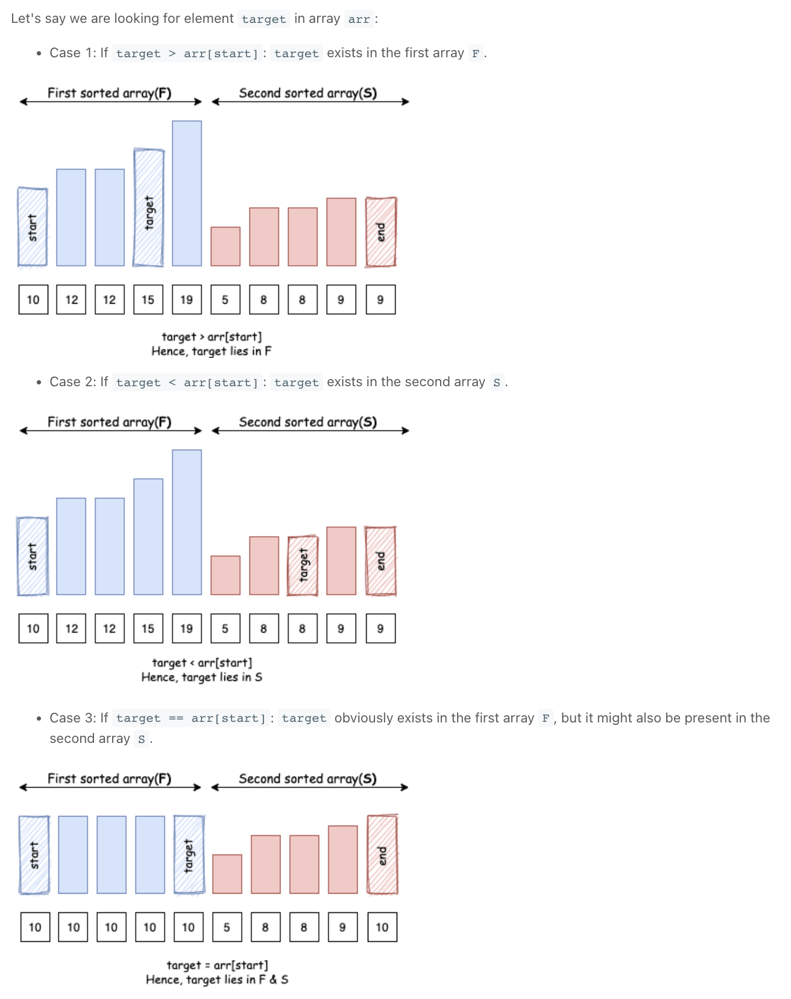
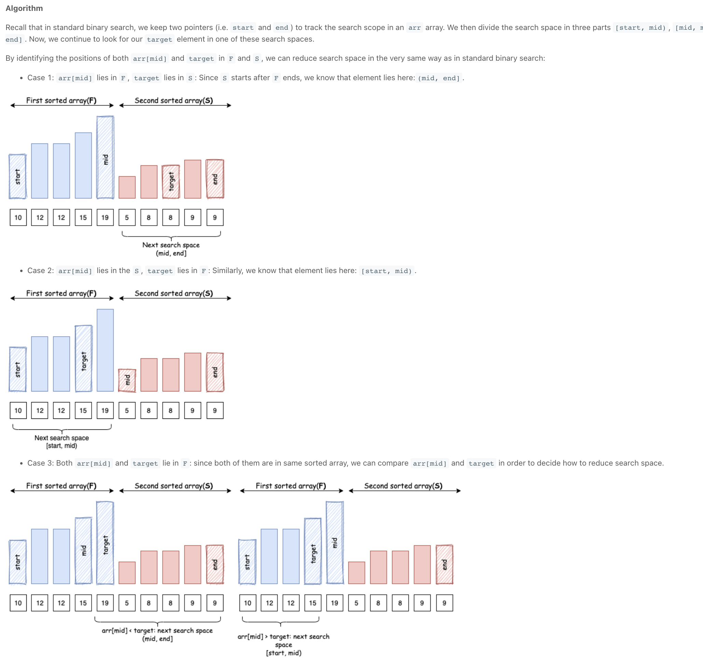
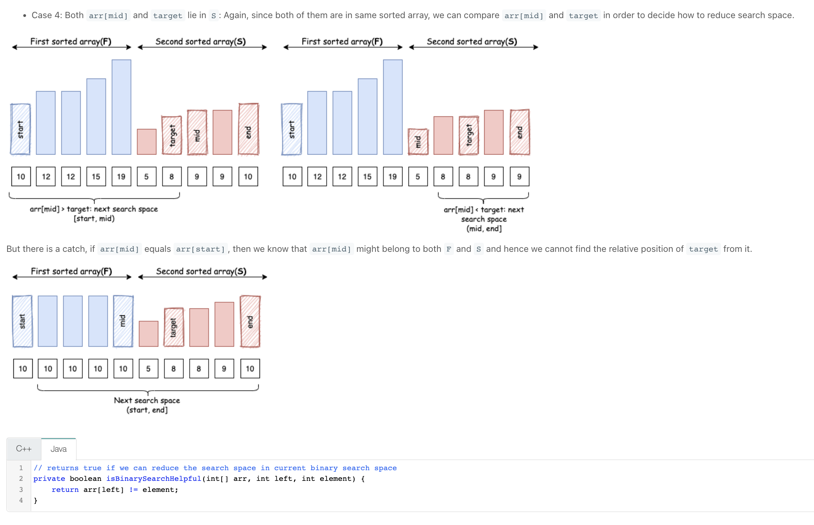

# 69. Sqrt(x)
## Problem (Easy):
Given a non-negative integer x, compute and return the square root of x.

Since the return type is an integer, the decimal digits are truncated, and only the integer part of the result is returned.

Note: You are not allowed to use any built-in exponent function or operator, such as pow(x, 0.5) or x ** 0.5.
```
Input: x = 8
Output: 2
```
## Solution:
find x for x^2 - a = 0
find x between interval 0 and a
because f(0) = -a <=0 f(a) = a(a-1) >= 0, f(x) is monotonically increasing, we can find one result make x^2 - a = 0.
### Brute Force:
loop over from 0 to x.
### Binary search:
time complexity: O(logn)
space complexity: O(1)
notes: 1. while condition. 2. return which value. 3. be carefull with dead loop (timeout).
```
class Solution {
    // binary search in 0-x
    public int mySqrt(int x) {
    
        int left = 0;
        int right = x;
        int mid = 0;
        
        while(left<=right) {
            mid = left + (right-left)/2;
            // notes: x*x might exceed max value of integer
            long target = (long) mid*mid;
            if(target==x) return mid;
            else if (target>x) {
                right = mid-1; // stop at equal target or first smaller than target position
            }else left=mid+1; // stop at equal targe or first larger than target position
        }  
        return right;
    }
}
```

# 81. Search in Rotated Sorted Array II
## Problem (Medium):
There is an integer array nums sorted in non-decreasing order (not necessarily with distinct values).

Before being passed to your function, nums is rotated at an unknown pivot index k (0 <= k < nums.length) such that the resulting array is [nums[k], nums[k+1], ..., nums[n-1], nums[0], nums[1], ..., nums[k-1]] (0-indexed). For example, [0,1,2,4,4,4,5,6,6,7] might be rotated at pivot index 5 and become [4,5,6,6,7,0,1,2,4,4].

Given the array nums after the rotation and an integer target, return true if target is in nums, or false if it is not in nums.

You must decrease the overall operation steps as much as possible.
```
Input: nums = [2,5,6,0,0,1,2], target = 0
Output: true
```
## Solution:
### Brute Force:
very simple. One for loop.
Time Complexity: O(n)
Space Complexity: O(1)

### Binary Search:
HARD!
Basic Idea is divide all cases in 3-4 cases to analyse and find binary search can still be applied here. One important thing is compare with start value to determine target in first part or second part of array. First & second are all sorted in increasing order.

Notes: as array contains duplicate values. There is one special edge case, which is mid value == start value. Just mov mid one more step to right. This edge case is hard to find. 

```
class Solution {
    public boolean search(int[] nums, int target) {
        // Binary Search: very complicated.
        // consider divide array into first part and second according to rotation index.
        // left is start here, every time we shrink our search area, we should determine again current situation is in which case 
        int left = 0; 
        int right = nums.length-1;
        
        while (left<=right) {
            int mid = left + (right-left)/2;
            if(nums[mid]==target) return true;
            // special case: 5 5 5 5   1 2 3 4 5
            // [1,1,1,1,1,2,1,1,1,1,  1,1,1,1,1,1,1,1,1]
            // if mid value == start value, it is hard to determine if fisrt part are equal to mid or second part are eqaul to mid.
            // In above case, if mid in second part, mid=start, we thought mid in first part, which is wrong
            // target is also in first part. 
            // Therefore, we will take second part [mid+1, right] as search area. But it is wrong. 
            // So move start one step right. 
            else if (nums[mid]==nums[left]) {
                left++;
            }
            // 8 9 10 11   1 2 3 4 6 6 7
            //case1: if both mid & target in the same part, we can handle it like normal binary search
            else if (existsInFirstPart(nums, nums[mid], left)==existsInFirstPart(nums, target, left)) {
                if (nums[mid]<target) {
                    left = mid+1;
                } else right = mid-1;
            } 
            //case2: mid in first part, target in second part
            else if (existsInFirstPart(nums,nums[mid], left)==true && existsInFirstPart(nums, target, left)==false) {
                left = mid+1;
            }
            //case3: mid in second part, target in first part
            else if (existsInFirstPart(nums,nums[mid], left)==false && existsInFirstPart(nums, target, left)==true) {
                right = mid-1;
            }
        }
        return false;
    }
    // helper to check element belongs to which part
    private boolean existsInFirstPart(int[] nums, int element, int start) {
        return element>=nums[start];
    }
}
```



